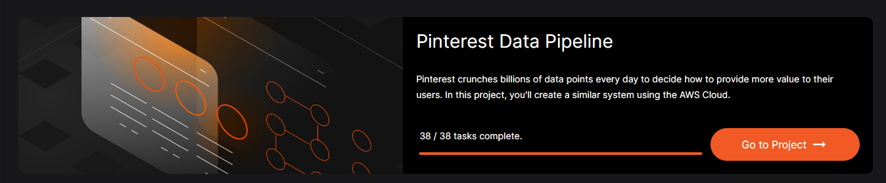
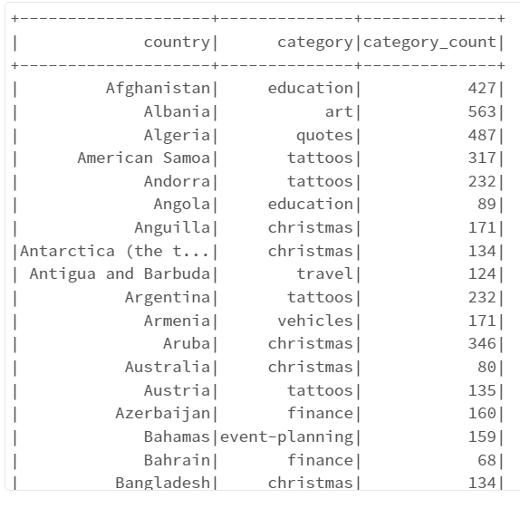
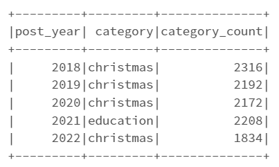
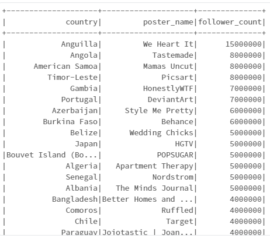
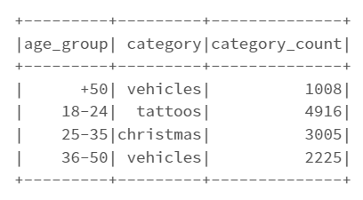
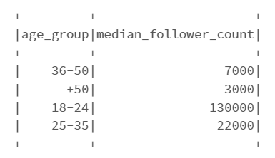
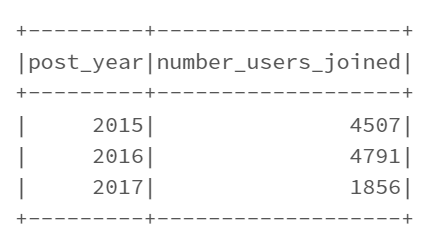
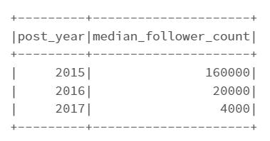
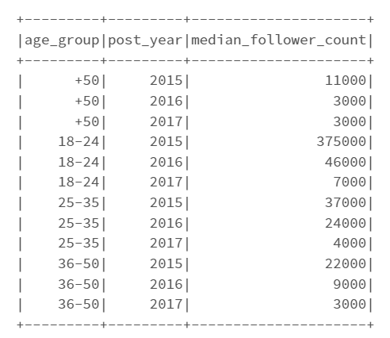

# **Pinterest Data Pipeline**

This is a project from AiCore to learn and understand data pipeline and data processing for batch and streaming data. It’s a step-by-step process and the main objective of this project is to make reliable and scalable data processing pipeline.

A data pipeline is a set of tools and processes that involve moving, processing, and storing data in a similar way that a water pipeline moves, processes, and stores water. In this project, AWS cloud services are used to create Pinterest data pipeline

### **Amazon Web Services**

The cloud is a network of remote servers hosted on the internet that can be used to store, manage, and process data. Amazon Web Services (AWS) is a cloud platform, with various services from data centers globally. These are the various AWS services used in the project
- AWS S3
- AWS EC2
- AWS MSK
- AWS API Gateway
- AWS MSK
- AWS Managed Apache Airflow
- AWS Kinesis

> ## **The Achitecture and the steps involved**

Two process are involved in this data pipelining
1. Batch data processing
2. Stream data processing

For the Batch data processing the data is extracted from the Amazon RDS using Kafka REST API that is installed within an EC2 Client machine and this data is stored in the Amazon S3 Bucket in json format. S3 Bucket is mount to the Databricks and data is load into Databricks. The data is then stored in dataframes and the data is then cleaned and analysed. To automate this process AWS MWAA (managed Workflows for Apache Airflow) can be used.

For the Streaming data, the data is extracted from the Amazon RDS using the REST API, the data is stored in the Kinesis steams in shards. This steaming data is loading into the Databricks in real-time and keeps appending into the dataframe. The data is cleaned and delta tables are created in the databricks 

### **Data Exploration**
We first explore a sample of data extracted from the amazon RDS and get familiarised with the table structure and its column information. These are the three tables:
- `pinterest_data`: contains data about posts being updated to Pinterest
- `geolocation_data`: contains data about the geolocation of each Pinterest post found in pinterest_data
- `user_data`: contains data about the user that has uploaded each post found in pinterest_data

>## **Batch Processing**

### **Setting up the EC2 instance & Apache Kafka**

EC2 instances are the building blocks of cloud computing. In essence, they are remote computers that can be employed to run code on a cluster or a single computer. An EC2 instance can be accessed through a terminal. 
- In the AWS console to set up an EC2 instance, key-pair file is created for authentication and a security group is created with the inbound rules as ‘HTTP: Anywhere IPv4’, ‘HTTPS: Anywhere IPv4’, ‘SSH: My IP’. 
- Created EC2 Instance choosing Amazon Linux 2 AMI.

- Once the EC2 instance is launched and connected, Kafka and IAM MSK authentication package is installed on the client EC2 machine and configured the Kafka client properties to use AWS IAM authentication.
- Amazon MSK Clusters are created and the three topics are created for three table in Kafka EC2 client machine using the Bootstrap server string and the Apache Zookeeper connection string from the MSK cluster.

### **Connecting MSK cluster to a S3 Bucket**

- In the Amazon S3 console created a S3 bucket. The data from the Amazon RDS will be extracted and stored into this S3 bucket.
- Created an IAM role that can write to this destination bucket.
- Created a VPC endpoint to S3.
- Created a custom plug-in under the MSK Connect and hence created a connector with the IAM role previously created.

### **Configuring API in AWS API Gateway**

- In the AWS API Gateway created API using REST API. 
- Create a new child resource for this API and selected proxy resource with the resource path to be `/{proxy+}`.
- Created the `ANY` method

### **Setting up the Kafka REST proxy on the EC2 client**
- Installed Confluent package for REST proxy on EC2 client
- Modified the kafka-rest.properties file with the bootstrap server and zookeeper connection string
- In the previously created API, for the Integration type selected HTTP Proxy
- For the Endpoint URL entered your Kafka Client Amazon EC2 Instance PublicDNS
- Deployed the API and got the invoke URL
- Using the emulation python script data is sent to the Kafka topics using the API Invoke URL and finally store them into the S3 Bucket (that was created previously) in the json format 

### **Batch processing in Databricks**
- Creating AWS Access Key and Secret Access Key for Databricks in the AWS, Uploaded credential csv file to Databricks.
- Mounting S3 bucket to Databricks, loaded the data stored in the bucket and created the dataframes for the three tables
- Using pyspark cleaned the tables such as 
    - Removing duplicate rows
    - Renaming and re-ordering the columns where necessary
    - Removing null values 
    - Replacing the values wherever necessary
    - Converting the datatype wherever necessary

-	To automate this process AWS MWAA (managed Workflows for Apache Airflow) can be used. 
-	Create an API token in Databricks and initialize a connection between MWAA and Databricks. 
-	A DAG file can be created in python, which specifies the notebook path to be used from Databricks, cluster id in AWS. 
-	It can be customised to run at regular intervals depending on the rate on incoming data. At the specified intervals, the notebook created will run automatically with the queries. 

### **Data Analysis**

*1. The most popular Pinterest category, people post to, based on their country.*

*2. Number of posts each category had between 2018 and 2022 and most popular category in each year.*

*3. The user with the most followers for each country*

*4. The most popular category people post to, based on the age groups - 18-24, 25-35, 36-50, +50*
 

*5. The median follower count for users in the age groups, 18-24, 25-35, 36-50, +50*

*6. How many users have joined between 2015 and 2020.*

*7. The median follower count of users who have joined between 2015 and 2020.*

*8. The median follower count of users who have joined between 2015 and 2020, based on age group that they are part of.*

>## **Stream Processing**

AWS Kinesis can collect streaming data in real time or near real-time. Kinesis enables you to process and analyse this data as soon as it arrives, allowing you to respond instantly and gain timely analytics insights. A Kinesis Data Stream is a set of Shards which is a uniquely identified sequence of data records in a stream
- First we create three data streams for three tables in the Amazon Kinesis console and then create an IAM role for API access to Kinesis
- In API Gateway console, opening the previously created REST API, we create a new resource for the streams and setup and configure a GET, POST, and DELETE method
- Creating two child resources 'record' and 'records' and setup and configure a PUT method for both the child resources and hence deploy the API, get a new invoke URL. This URL is used to extract data from Amazon RDS and store it in the respective kinesis data streams
- The data is loaded into the Databricks similar to that of batch processing and Dataframes are created. The data keeps appending to the dataframe. The data will be read in serialized format and can be deserialized using the .selectEcpr() method.
- These Dataframes are then cleaned and data analysis is been performed using PySpark